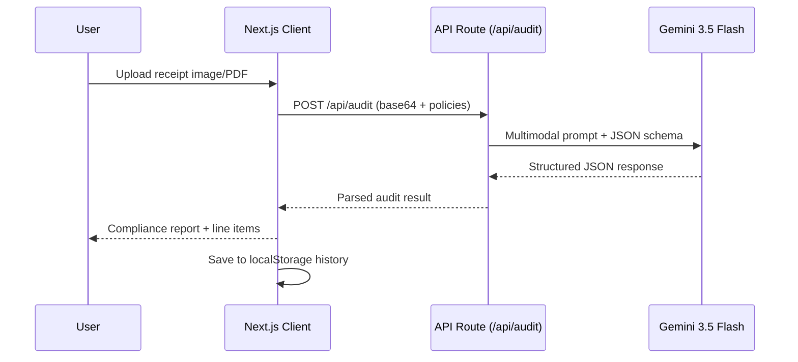

<div align="center">

# 📄 Paper Trail

### Automated Expense & Invoice Auditor

**AI-powered receipt scanning and policy compliance checking for small businesses**

[](https://nextjs.org/)
[](https://ai.google.dev/)
[](https://www.typescriptlang.org/)
[](https://react.dev/)
[](LICENSE)

---

*Small businesses lose hours manually inputting invoices and checking them against company expense policies.*
*Paper Trail automates that entire workflow with a single upload.*

</div>

---

## ✨ Features

| Feature | Description |
|:--------|:------------|
| **🧾 Multimodal Invoice Scanning** | Upload a photo or PDF of any receipt or invoice. Gemini reads and extracts every detail. |
| **🛡️ Policy Compliance Engine** | Define custom expense rules in natural language. Every invoice is automatically checked against them. |
| **📊 Spend & Compliance Analytics** | Interactive SVG charts: compliance donut ring, category spend distribution bars, and summary cards. |
| **📋 Corporate Audit Ledger** | Persistent history of every audit — searchable, filterable, and exportable. |
| **⚡ One-Click Sample Testing** | Built-in mock receipts (compliant and non-compliant) so you can test immediately with zero setup. |
| **🔁 Resilient API Layer** | Automatic model fallback (`gemini-3.5-flash` → `gemini-2.5-flash`) with exponential backoff retries. |

---

## 🏗️ Architecture

```
paper_trail/
├── app/
│   ├── api/
│   │   └── audit/
│   │       └── route.ts          # Server-side Gemini API endpoint
│   ├── globals.css               # Design system (glassmorphism dark theme)
│   ├── layout.tsx                # Root layout with metadata
│   └── page.tsx                  # Main dashboard (upload, policies, analytics, history)
├── public/
│   └── samples/
│       ├── compliant_receipt.png      # Mock: office supplies ($48.49)
│       └── non_compliant_receipt.png  # Mock: dinner with alcohol ($91.50)
├── .env.local                    # Gemini API key (not committed)
├── .github/
│   └── dependabot.yml            # Automated dependency PR reviews
├── generate_samples.py           # Python script to regenerate sample receipts
├── verify_audit.py               # Python script for headless API testing
├── package.json
├── tsconfig.json
└── next.config.ts
```

### How It Works



---

## 🚀 Getting Started

### Prerequisites

| Requirement | Version | Check |
|:------------|:--------|:------|
| **Node.js** | ≥ 18.x  | `node -v` |
| **npm**     | ≥ 9.x   | `npm -v` |
| **Gemini API Key** | — | [Get one here](https://aistudio.google.com/apikey) |

> [!IMPORTANT]
> The `next: not found` error means dependencies haven't been installed yet.
> You **must** run `npm install` before `npm run dev`. See steps below.

### Step 1 — Clone the Repository

```bash
git clone https://github.com/your-username/paper_trail.git
cd paper_trail
```

### Step 2 — Install Dependencies

```bash
npm install
```

This installs Next.js, React, TypeScript, and all required packages into `node_modules/`.

### Step 3 — Configure Environment Variables

Create a `.env.local` file in the project root:

```bash
cp .env.example .env.local
```

Or manually create it:

```bash
echo 'GEMINI_API_KEY=your_gemini_api_key_here' > .env.local
```

> [!CAUTION]
> Never commit `.env.local` to version control. It is already listed in `.gitignore`.

### Step 4 — Start the Development Server

```bash
npm run dev
```

Open **[http://localhost:3000](http://localhost:3000)** in your browser.

### Step 5 — Try It Out

1. Click **"Acme Office Supplies"** sample → Click **"Execute Policy Compliance Audit"** → Should **pass** ✅
2. Click **"Grillhouse Bistro Dinner"** sample → Click **"Execute Policy Compliance Audit"** → Should **fail** ❌ (alcohol detected)
3. Upload your own receipt image or PDF and audit it against your custom policies.

---

## 🔧 Available Scripts

| Command | Description |
|:--------|:------------|
| `npm install` | Install all dependencies (required before first run) |
| `npm run dev` | Start the development server on `localhost:3000` |
| `npm run build` | Create an optimized production build |
| `npm start` | Serve the production build |

### Utility Scripts

```bash
# Regenerate the sample receipt images (requires Python 3 + Pillow)
python3 generate_samples.py

# Run a headless API smoke test against a running dev server
python3 verify_audit.py
```

---

## 🛡️ Policy Engine

Paper Trail ships with **four default rules** that can be toggled on/off:

| Rule | Default | Description |
|:-----|:--------|:------------|
| Maximum Transaction Limit | ✅ On ($100) | Flags invoices exceeding the configurable dollar cap |
| Restricted Item: Alcohol | ✅ On | Flags alcohol, liquor, wine, beer, or bar purchases |
| Receipt Recency | ✅ On | Flags receipts older than 90 days |
| Weekday Expense Rule | ❌ Off | Flags transactions on weekends |

### Custom Natural-Language Rules

Navigate to the **Policy Manager** tab and add rules in plain English:

```
"IT equipment purchases over $500 require manager pre-approval"
"Uber rides after 10 PM must include a business justification"
"No entertainment expenses on Fridays"
```

These rules are injected directly into the Gemini system prompt and evaluated dynamically.

---

## 🧪 Troubleshooting

<details>
<summary><strong><code>next: not found</code></strong></summary>

This means `node_modules/` is missing. Run:

```bash
npm install
```

Then retry:

```bash
npm run dev
```

</details>

<details>
<summary><strong><code>503 Service Unavailable</code> from Gemini</strong></summary>

This is a transient error from Google's API. Paper Trail automatically:
1. Retries up to **3 times** with exponential backoff (1s → 2s → 4s)
2. Falls back from `gemini-3.5-flash` to `gemini-2.5-flash`

If it persists, wait a few minutes and try again.

</details>

<details>
<summary><strong><code>GEMINI_API_KEY</code> not configured</strong></summary>

Make sure `.env.local` exists in the project root with:

```env
GEMINI_API_KEY=your_key_here
```

Restart the dev server after creating or modifying this file.

</details>

<details>
<summary><strong>Sample receipts return <code>404</code></strong></summary>

The sample images need to exist at `public/samples/compliant_receipt.png` and `public/samples/non_compliant_receipt.png`. Regenerate them:

```bash
python3 generate_samples.py
```

</details>

---

## 🤝 Contributing

Contributions are welcome! Please follow these steps:

1. **Fork** the repository
2. **Create** a feature branch: `git checkout -b feat/amazing-feature`
3. **Commit** your changes: `git commit -m 'feat: add amazing feature'`
4. **Push** to the branch: `git push origin feat/amazing-feature`
5. **Open** a Pull Request

> [!NOTE]
> Dependabot is configured to automatically open PRs for dependency updates.
> Pre-commit hooks validate that the TypeScript build passes before each commit.

---

## 📄 License

This project is licensed under the MIT License — see the [LICENSE](LICENSE) file for details.

---

<div align="center">

**Built with [Next.js](https://nextjs.org) • Powered by [Google Gemini](https://ai.google.dev/) • Styled with 💜**

</div>
